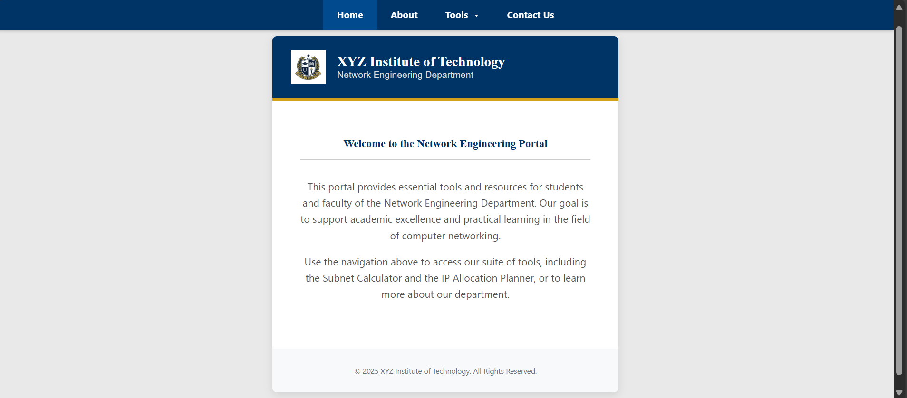
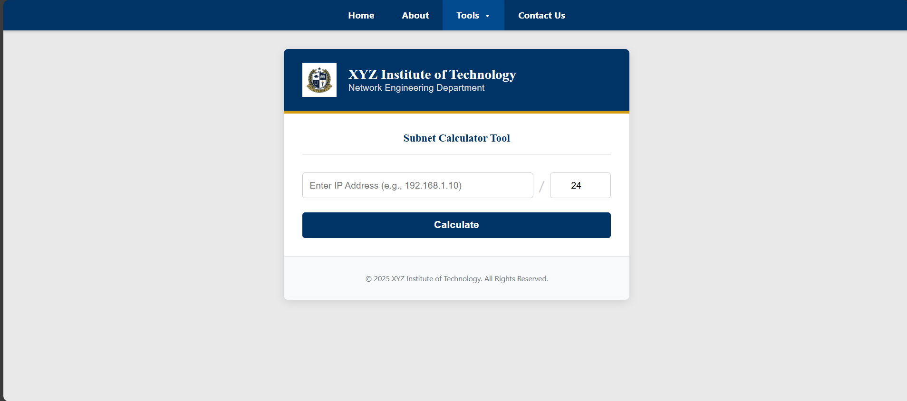

# 🌐 Visual Subnet Calculator

A **web-based subnetting and IP allocation suite** 
This project bridges theory and practice in computer networking by providing an **interactive subnet calculator** and a **dynamic IP allocation planner** through a modern, browser-based interface.

---

## Project Overview

**Visual Subnet Calculator** is a learning and visualization tool that helps users:
- Calculate subnet details (Network Address, Broadcast Address, Usable Hosts, etc.) for any IPv4 address.
- Plan and allocate IP addresses efficiently using an interactive IP Allocation Planner.
- Understand subnetting concepts visually through binary representations and intuitive UI design.

This tool is designed to assist students and faculty in **understanding, verifying, and applying subnetting principles** practically.

---

## Features

### 🔹 Subnet Calculator (Backend in C - CGI)
- Takes an **IPv4 address** and **CIDR prefix** as input.  
- Computes:
  - Network & Broadcast addresses  
  - Usable Host Range  
  - Subnet Mask  
  - Total & Usable Hosts  
  - IP Class and Type (Public/Private)  
  - Binary Representations  
- Uses **Winsock2 API** for accurate IP manipulation.  
- Returns results as **JSON** for easy frontend integration.  

### 🔹 IP Allocation Planner (Frontend in JavaScript)
- Allows users to **allocate subnets** to various departments dynamically.  
- Tracks **used vs. remaining IPs** in real-time.  
- Entirely **client-side**, requiring no server interaction after loading.  
- Helps simulate real-world **IP address management (IPAM)**.

---

## System Architecture

| Component | Technology | Description |
|------------|-------------|-------------|
| **Frontend** | HTML5, CSS3, JavaScript | UI and interactivity |
| **Backend** | C Language (CGI) | Handles subnet calculations |
| **Web Server** | Any CGI-compatible server | Executes backend C program |
| **Protocols Used** | HTTP/HTTPS, TCP/IP | Client–Server communication |

Two distinct architectures are used:
- **Client–Server model** for the Subnet Calculator  
- **Client-side model** for the IP Allocation Planner  

---

## Tech Stack

- **Programming Languages:** C, JavaScript  
- **Frontend:** HTML5, CSS3  
- **Backend:** C (with Winsock2 and CGI)  
- **Tools:** GCC / MSVC, Web Browser  
- **Operating System:** Windows / Linux  

---

## Objectives

- ✅ Build a functional and accurate subnet calculator  
- ✅ Create a user-friendly IP allocation planner  
- ✅ Reinforce educational understanding of subnetting  
- ✅ Demonstrate efficient use of CGI with C  
- ✅ Design a clean, accessible, responsive interface  

---

## Learning Outcomes

- Practical understanding of subnetting and IP address management  
- Exposure to CGI programming and backend–frontend integration  
- Hands-on experience in combining **low-level (C)** and **web-based (JavaScript)** technologies  
- Reinforcement of core networking and web development concepts  

---

## Screenshots

### Home Page


### Subnet Calculator


### IP Allocation Planner


---

## File Structure

```
Visual-Subnet-Calculator/
│
├── calculator.c          # Backend C code (CGI)
├── ipam.js               # Frontend JS for IP allocation planner
├── style.css             # UI design and layout
├── index.html            # Home and navigation structure
├── README.md             # Project documentation
└── report/               # Project report (CN REPORT.doc)
```

---

## References

1. [GeeksforGeeks – Introduction to Subnetting](https://www.geeksforgeeks.org/computer-networks/introduction-to-subnetting/)  
2. [Scaler – Subnetting in Computer Networks](https://www.scaler.com/topics/computer-network/subnetting/)  
3. [Larus Networks – Understanding IP Address Allocation](https://larus.net/blog/understanding-process-of-ip-address-allocation/)  
4. [GeeksforGeeks – Classful IP Addressing](https://www.geeksforgeeks.org/computer-networks/introduction-of-classful-ip-addressing/)

---
## Future Works

The Visual Subnet Calculator can be expanded in several directions:

1. **IPv6 Support:** Extend subnet calculations to support IPv6 addressing and CIDR operations.
2. **Persistent Storage:** Allow users to save and load subnet allocation plans.
3. **User Authentication:** Add login functionality for personalized subnet plans.
4. **Visualization Dashboard:** Integrate graphical visualizations (e.g., network topology maps).
5. **Deployment:** Host the web app on a public cloud or university server for broader access.
6. **AI-Assisted Planning:** Incorporate predictive algorithms to suggest optimal subnet distributions.

---


## Timeline

- **Course:** 23AD551 – Computer Networking Laboratory  
- **Semester:** July 2025 – November 2025  
- **Department:** AI & DS  

---

## Conclusion

The **Visual Subnet Calculator** successfully combines the performance of C with the flexibility of JavaScript to deliver a powerful educational platform.  
It not only automates subnetting but also enhances conceptual learning through visualization and interactivity.

---

## 📜 License

This project is licensed under the **MIT License**.

---